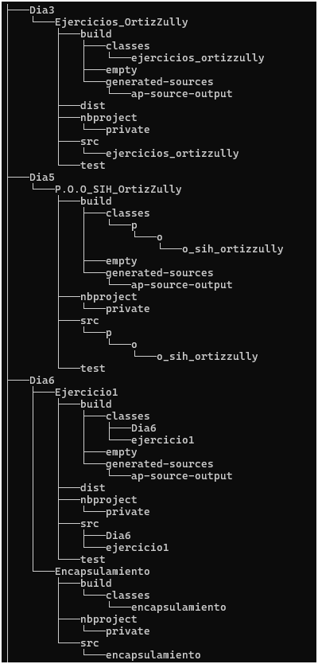
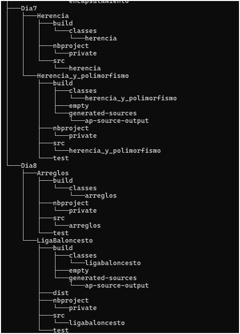

# Java2_OrtizZully

Este repositorio contiene diversos proyectos y ejercicios en Java, Organizados en diferentes carpetas por Dias donde tienen diferentes temas como POO (Programación Orientada a Objetos), Herencia, Polimorfismo y Encapsulamiento.

## Contenido 

* 📂 Dia3
---
 
| 🔹 Proyecto | 📜 Descripción |
|--------|-----------|
|**Ejercicios_OrtizZullyJava**| Consta de 45 ejercicios la cual cada ejercicio resuelve un problema especifico|
---
* 📂 Dia5
---
| 🔹 Proyecto | 📜 Descripción |
|--------|-----------|
|**poo_sih_ortizzully**| Implementa un Sistema integrado Hospitalario (SIH), aplicando paradigma de Programación Orientada a Objetos (POO) donde permire la gestion de hospitales, departamentos, personal, doctores, pacientes y equipos medicos.|
---
* 📂 Dia6
---
| 🔹 Proyecto | 📜 Descripción |
|--------|-----------|
|**Ejercicio1**| Consta de una breve explicacion de como realizar el metodo de encapsulamiento. |
|**Encapsulamiento** | Demuestra el principo de encapsulamiento en Java, que permite restringir el acceso a los atributos de una clase y proporcionar metodos de acceso (`getters` y `setters`) para manipularlos de forma controlada. |
---
* 📂 Dia7
---
| 🔹 Proyecto | 📜 Descripción |
|--------|-----------|
|**Herencia**| Consta de una breve explicacion de como realizar el metodo de herencia y polimorfismo. |
|**Herencia_y_polimorfismo** | Demuestra el uso de herencia y polimorfismo en Java, aplicando en las clases como vehiculo y empleados. |
---
* 📂 Dia8
---
| 🔹 Proyecto | 📜 Descripción |
|--------|-----------|
|**Arreglos**| Consta de una breve explicacion de como realizar y utilizar arreglos y matrices . |
|**LigaBaloncesto** | Proyecto sobre la gestion de una liga de Baloncesto donde permite la gestion de partido, partidoLiga, partidoPlayOffs. |
---
## Estructura

## Instalacion y uso.

- Debes tener netbeans
- Descagas las carpetas y lo abres.
- Ejecutar codigo

## 🛠️ Lenguajes usados 

* Java 

## Créditos.

Elaborado por Zulluy Fernanda Ortiz Avendaño Cc. 1092528097
